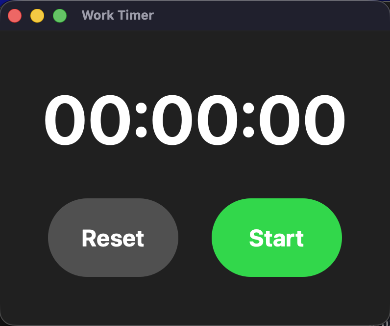

# ⏱️ Qt Work Timer

A modern, dark-themed stopwatch application built with C++ and Qt 6.

## ✨ Features

* **Clean UI:** Modern dark theme with custom CSS styling.
* **Intuitive Controls:** Toggle between Start, Pause, and Resume with dynamic color cues (iOS-style).
* **Performance:** Lightweight C++ logic with efficient memory management.
* **Cross-Platform:** Runs on Windows, Linux, and macOS (requires Qt).

## 🛠️ Prerequisites

Before building, ensure you have the following installed:
* **C++ Compiler** (GCC, Clang, or MSVC)
* **CMake** (Version 3.16 or higher)
* **Qt 6** (Core and Widgets modules)
